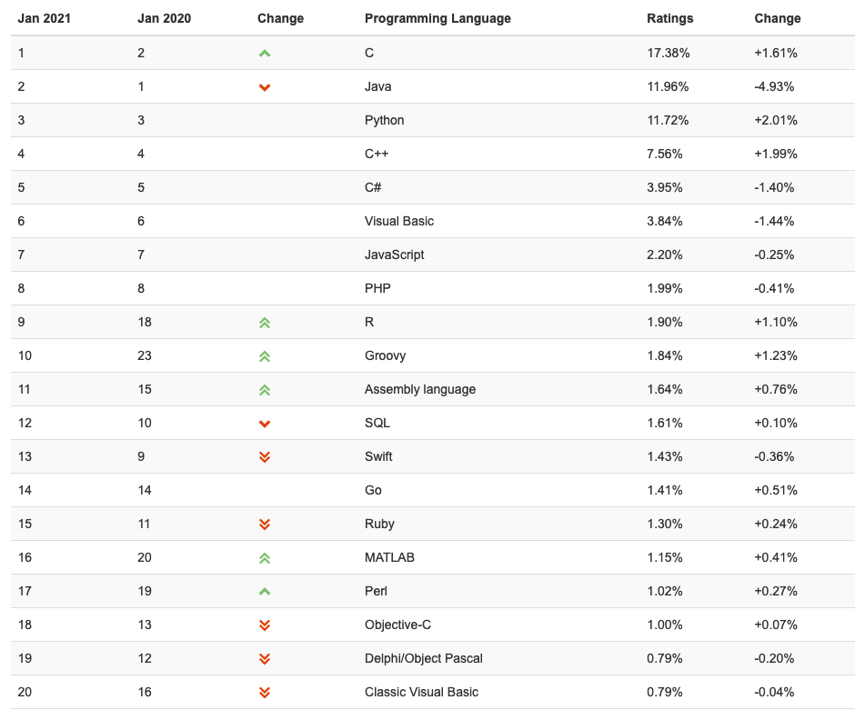
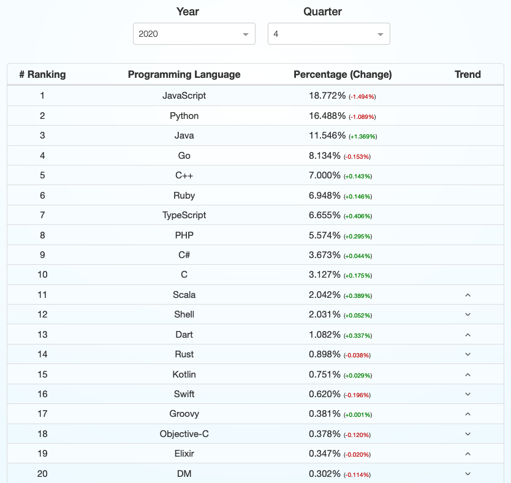
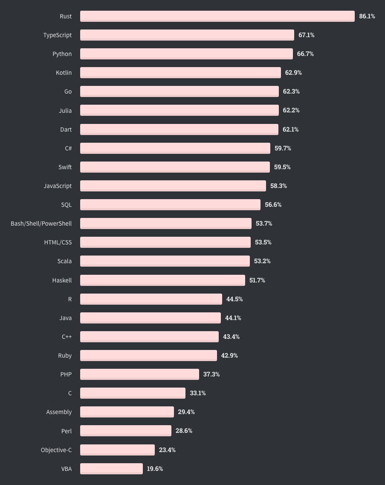
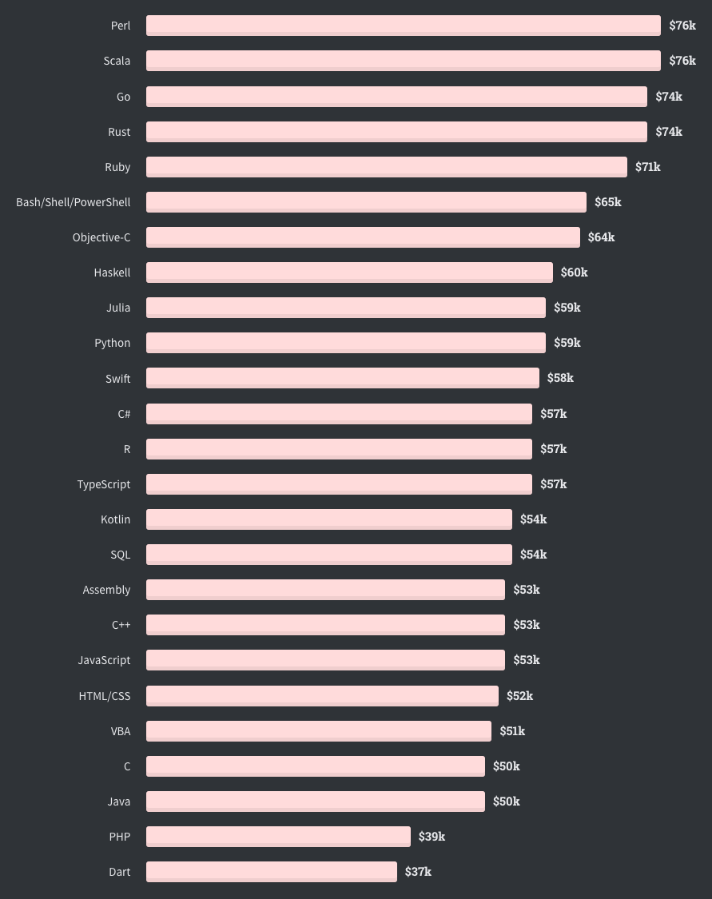
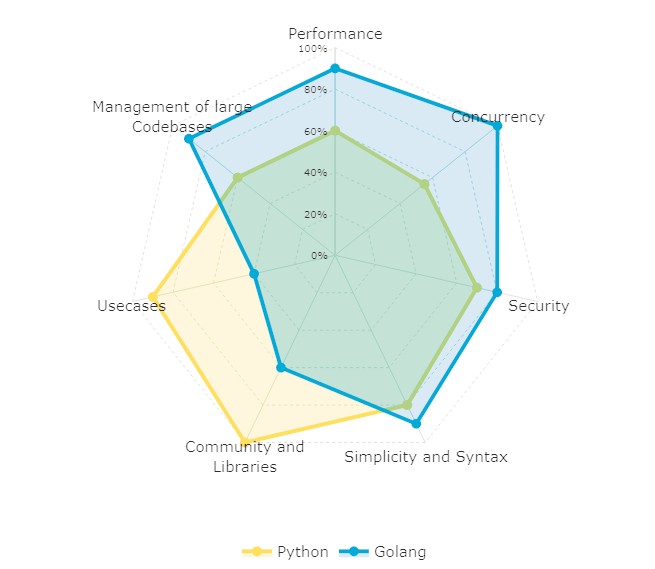

# Golang vs Python - Language Comparison

Hey there!

In this series of 5 or so upcoming posts, I'll be comparing Golang to Python in various disciplines.

What is my goal with this?

Originally the idea of writing blog posts came from [this](https://www.psychotactics.com/art-retain-learning/) great article about how people learn and how to retain more of what you have learned.

Shockingly, you only retain 10% of what you read, but 90% if you teach it to someone else. Well, that's what I'm trying to do here. So bare with me and don't be too hard on mistakes, after all, it's a long journey of learning for all of us.

> In this world, you're either growing or you're dying so get in motion and grow.
>
> ― Lou Holtz

## Table of Contents

1. Why learn a new language?
2. What is Python and where is it used?
3. What is Golang and where is it used?
4. Popularity
5. Strengths and Weaknesses
6. Takeaway

## Why learn a new language?

Let me quote David Thomas and Andrew Hunt from their book [“The pragmatic Programmer”](https://pragprog.com/titles/tpp20/the-pragmatic-programmer-20th-anniversary-edition/) on this subject  (if you haven’t read it, I’d highly recommend doing so).

“Different languages solve the same problems in different ways. By learning several different approaches, you can help broaden your thinking and avoid getting stuck in a rut.

The process of learning alone will expand your thinking, opening you to new possibilities and new ways of doing things.”

Also, to decide which language to learn, you need to consider what role you are in. Are you someone who makes design decisions for the further development of a project that has specific requirements, are you someone who is looking for work, or are you a freelancer?

* If you make the design decisions, you probably look at this in terms of whether it meets the specified requirements and whether you can find enough engineers with knowledge of that language
* If you are looking for a job in a company or as a freelancer, it is probably more important for you to learn a language that firstly complements your area of interest and secondly has a job market for it in the geographical area you are looking for

## What is Python and where is it used?

Python is a popular general-purpose programming language that can be used for a wide variety of applications. It includes high-level data structures, dynamic typing, dynamic binding, a very clear almost pseudo-code like syntax, and many more features that make it as useful for complex application development as it is for scripting or "glue code" that connects components together. It can also be extended to make system calls to almost all operating systems and to run code written in C or C++.

Due to its ubiquity and ability to run on nearly every system architecture, it is used in virtually every industry and scientific field that you can imagine, including:

* Data Science
* Machine Learning
* Data Analysis
* Web Development
* Computer Vision and Image Processing
* Data Engineering
* Biology and Bioinformatics
* Astronomy
* All sorts of small Scripts

## What is Golang and where is it used?

Go was developed by Google employees—chiefly longtime Unix guru and Google distinguished engineer Rob Pike—but it’s not strictly speaking a “Google project.” Rather, Go is developed as a community-led open-source project, spearheaded by leadership that has strong opinions about how Go should be used and the direction the language should take.

Go is meant to be simple to learn, straightforward to work with, and easy to read by other developers. Go does not have a large feature set, especially when compared to languages like C++.

It's one of those new kids on the block with friends like Rust, Kotlin, and Julia that are designed from the ground up with performance, concurrency, and safety in mind while still having a clear syntax.

Considering only the runtime costs here, it's also very likely cheaper than Python to operate.

What do I mean by this?

Time is money. The faster and more memory-efficient the code runs, the fewer server resources 💸💸💸 it consumes. In addition, the combination of typing and easy scalability saves a whole lot of personnel costs for developers to write efficient and secure code.

Golang is mainly used in:

* Web Development
* Databases
* Network Programming
* Systems Programming
* DevOps

## Popularity

So how popular are these languages? Let's take a look at some statistics.

#### TIOBE

In 2020, Python was named TIOBE Programming Language of the Year for the fourth time. That's a record! In January 2021, it ranks 3rd behind C and Java, while Go ranks in 14th place.

#### GitHub Pull Requests

Pull requests can be a good Indicator of how actively tools and frameworks are being worked on.

#### Stackoverflow Most Loved

For 2020, Python was the third most popular language, with Go close behind in 5th place.

#### Top Paying Languages

In terms of which language pays the most on average, Python is far behind with $59k compared to Go with $74k gross earnings per year.

#### Job Openings on Indeed

A quick search revealed the following

Indeed US

* Python Developer = 27683
* Go + Golang Developer = 4201

Indeed Germany (where I’m from)

* Python Developer + Python Entwickler = 4202
* (Go + Golang Developer) + (Go + Golang Entwickler) = 1909

## Strengths and Weaknesses

Here comes a chart on which you can quickly compare both languages. Why doesn't everyone do it this way? This chart is opinionated and no scientific method was used to calculate these percentages. I would welcome a discussion on how to make this comparison more scientific and general.

#### Runtime Performance (Go):

If you are coming from Python, you will be surprised how fast code can be executed. Golang is orders of magnitude faster than Python in almost every discipline. Within my tests, Python also uses much more CPU and memory resources than Go.

#### Concurrency (Go):

Golang has a great concurrency build in that is both easier to implement than in Python and much more efficient. It does so using Goroutines which are extremely lightweight threats and Channels which are pipelines that provide a way for one goroutine to send structured data to another.

#### Security (Go):

Python is not far behind, but I would still give preference to Golang because there are fewer opportunities for runtime errors since it is a typed language. Additionally, concurrency is the source of several types of tricky problems and security bugs. If you are not careful with concurrency, then one step can process a value that another step changes in the middle of the process. This can lead to vulnerabilities such as [double-spending](https://en.wikipedia.org/wiki/Double-spending) errors. Golang handles save concurrency nicely with its build-in Goroutines, Channels, and Mutexes.

#### Simplicity and Syntax (Go):

Although Python's syntax is very clean and almost as easy to read as plain English, I still see Golang as the winner here because many find it easier to reason about what the code does when types are specified. Also, Golang requires less syntax to learn and has many powerful built-in features like a webserver to create APIs right out of the box.

#### Community and Libraries (Python):

You simply can't beat Python for its large community and sheer amount of frameworks and useful libraries. It doesn't matter what you're working on, there are plenty of tools to choose from.

To name a few examples:

* **Numpy** for array handling and complex matrix functions
* **Tensorflow**, **scikit-learn** for deep learning
* **OpenCV** for image processing
* **Pandas**, **Dask**, **Koalas** and **PySpark** for data analysis and transformation
* **Mathplotlib**, **Plotly**, **Bokeh** for visualization
* **Django**, **Flask**, **FastAPI**, **Starlette** for web development
* And the list goes on and on...

#### Usecases (Python):

As stated several times, Python is the second-best language in almost every field of computing. This is because Python can be used almost everywhere and does a pretty good job at it. Often it comes down to whether Python is good enough to solve it or if a more specialized language needs to be used.

#### Management of large Codebases (Go):

Because of its philosophy of having only one solution to a problem and because it is a typed language with a clean syntax, it is much easier to handle larger codebases.

## Takeaway

Truth is, there is no language out there that simply is the best. There can only be a language that is more appropriate in a particular set of circumstances than others. **Talking about Golang vs. Python, with the suggestion there can be a 'winner', is plain wrong.** It is good comparing languages, knowing their strengths and weaknesses, and then go ahead and pull the appropriate language for the task at hand from your tool belt.

That’s it for this post and if you find any errors or mistakes I’ve made, I’m happy to read about them in the comments and correct them. Until then, stay healthy!